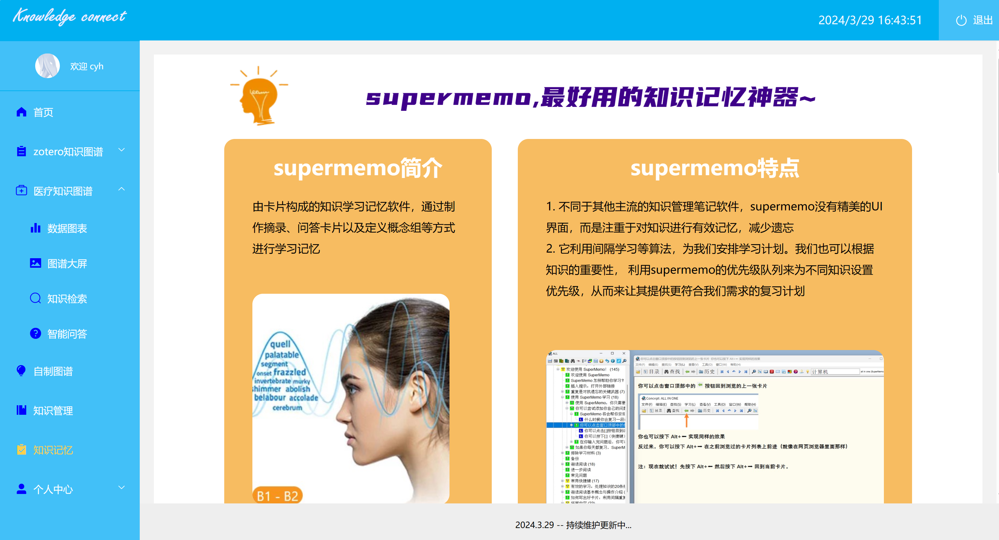

# KG-Rearch —— 知识图谱的关联与图形化展示研究

## 1. 项目简介
本项目致力于研究知识图谱，主要从网上数据集、个人笔记和其他相关资料中获取数据，探索其中的实体和之间的关系，并提取出三元组存储到图数据库neo4j中。最终导出json数据并利用echarts在前端做图形化展示  
项目展示网页地址： **http://cyhgraph.fun/**

## 2. 功能介绍
### 2.1 基本登录注册等功能
登录该系统时，用户可以注册一个账号后进行登录，在个人中心选项卡中，用户可以进行更换头像、修改密码等个人信息的操作。点击右上角可退出登录。相关展示图如下：

### 2.2 首页展示
有对知识图谱以及本项目的研究介绍，还有相关页面、链接跳转等操作，相关展示图如下：

### 2.3 图数据库展示
在前端网页中，用户点击相关专题的全屏展示，会以图的形式展示该部分数据集下的实体以及之间的密切关联。相关展示图如下：

### 2.4 简单问答
用户询问对应专题中的内容，系统会给出相应的回答，不过数据集大小有限，超出语料库内容的问题，系统暂时无法给予处理。相关展示图如下：

### 2.5 图表展示
除了图结构，用户点击数据图表还可以查看其他结构的数据展示分布，比如饼图、折线图、柱状图的展现形式。相关展示图如下：

### 2.6 知识检索
用户点击知识检索板块，在输入框中进行节点搜索，会展示出以该节点为中心的所有关联节点，并以图的方式呈现在下方。相关展示图如下：

同时，在图的右侧有这些节点对应的列表，点击列表中对应的内容，会进行节点关联搜索跳转，从而查看以相邻节点为中心的关系图。相关展示图如下：

### 2.7 自制图谱
用户在相应输入框中可以进行节点和关系的增删改查，同时会在右侧展现对应的自制图谱关系图，实现diy自制图谱。相关展示图如下：

## 3. 技术实现
技术栈： `python + neo4j + mysql + vue2 + node.js`  
版本： `python3.12` `neo4j DBMS 4.3.0(不能过高，5.0以上的py2neo不支持)`  
`mysql 8.0.36-0ubuntu0.22.04.1` `node 20.11.1`
### 3.1 数据收集和预处理
**数据来源**  
网上收集相关数据集（csv/xlsx格式）、obsidian、zotero、supermemo知识管理软件中的个人笔记
**数据预处理**  
对于网上数据集，若数据完整则无需进行预处理，否则推荐用pandas进行某些行列的筛选或修改  
对于个人笔记  
在obsidian书写笔记时，我会在实体部分插入双向链接，进行某些重要知识点的关联  
用zotero管理论文书籍时，会在其中pdf进行高亮批注和注释的书写  
用supermemo时，我会在其中插入卡片，进行相关记忆学习（但是由于其复杂的结构和一言难尽的ui设计，劝退了我进行深入研究QAQ...）  
### 3.2 实体关系抽取
对于预处理好的csv数据集，可以利用pandas进行快速的行列筛选处理，得到相关字段列的数据对应关系  
对于obsidian中的数据，我在实体双向链接的部分都加了**markdown**的加粗效果，通过正则提取** **其中的内容可以取出节点，同时根据obsidian双向链接对于的链接字符也可以构建实体间的关系  
对于zotero，官方在官网中提供了获取个人知识库的方法，有了对应id和key密钥，便可以连接本地的zotero并在python中获取到zotero所有的重要的数据信息，以json的方式呈现所有item，通过查看json的结构，根据实际需求便可进行相应item的抽取和关系建立
### 3.3 构建三元组，存入neo4j
抽取好实体和关系之后，便可以通过`实体 - 关系 - 实体`的形式来构建出三元组  
有了三元组之后，便可利用py2neo来连接个人的neo4j，构建cypher语句，并执行语句将图数据存入到neo4j中  
成功以后，我们便可以在neo4j里查看已构建好的图数据库，其中会以图、json等格式展示这些数据
### 3.4 导出json数据进行关系图构建
neo4j中支持对json数据进行导出，通过导出这些json数据，可以将其放到node.js的js代码中，并通过对应的接口向外暴露出这些数据，前端发起请求获取数据后，进行相应的三元组重建，便可得到最终的图谱数据：实体列表以及多个不同关系组成的二维数组
### 3.5 前端图谱展示
有了图谱数据后，利用echarts，配置好相关绘图参数格式后，便可绘制出关系图并在前端网页中进行可视化展示  
此外，利用echarts也可以对图谱数据进行其他图表绘制与展示
### 3.6 前端其他功能
#### 登录注册
利用mysql存储用户信息，用户进行注册后，会将该行数据存入mysql，进行登录时会对用户账号密码是否对应等情况进行判断。  
此外，登录和注册时都有对用户输入的格式进行合法校验，格式不正确会在登录注册前弹出相应提示。  
在前端环境中配置了`相应的请求、响应拦截器`，用户登录后会为其配置`token`，有效期为10小时。之后用户请求与个人中心相关的接口服务时，都需要携带token才会被后端处理。在10h有效期内，请求会先经过请求拦截器，为其加上token，因此后端接口均可以正常使用。若token过期，则在页面刷新时会被拦截并跳转到登录页，让用户重新登录。
#### 知识检索
搜索功能：遍历所有节点，直到节点与输入框中的对应后break，同时根据这个节点遍历获取其所有相邻节点，构建出新的小图谱并用echarts绘制关系图  
节点关联跳转：点击节点后，也是遍历图谱数据获取到该节点后break，同时遍历获取其所有相邻节点，进行关系图的重新绘制
#### 智能问答
对数据集中的所有数据进行所有可能的问题和答案的搜集，利用字符串的模糊匹配等操作获取答案关键词，最后通过相关语句拼接处理使得回答的句子通顺、逻辑合理。
#### 自制图谱
根据用户的节点关系输入，进行图数据的增删改查，并不断进行图数据的重构和关系图的绘制，在前端实时展示diy自制图谱
#### 个人中心
更换头像，修改密码就是普通的对数据库的增删改查操作，此部分涉及用户个人信息，其请求需要携带token才可被后端所处理，前面的知识检索等请求则无需携带token
#### 其他页面
基本是静态页面，包括各种知识图谱的图形化研究介绍、相关页面和知识链接跳转等，主要的作用就是"美观"哈哈~  
以下是相关页面展示：

(知识链接)

(supermemo)

## 4. 总结与展望
本项目为作者`大一 - 大二学年的大创项目`，基本实现了知识图谱的数据采集、处理、存储过程并进行可视化展示，取得较好成果。当然也有很多不足之处，如智能问答并没有结合深度学习展开，vue2技术栈现已有些过时等等。由于水平有限，并没有做得多么深入，不过还是希望这个较为简单的项目，能对初步踏入知识图谱领域研究的人带来帮助。最后，如果觉得本项目对你有帮助的话，求求点个star🤩吧，谢谢了~